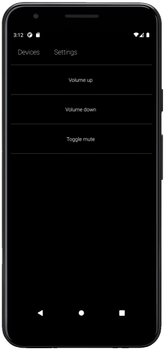
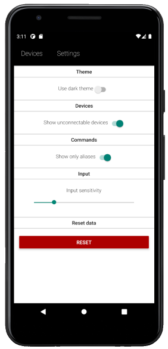

Mobile client of the [Rusko](https://github.com/aalhitennf/rusko-server) remote server.  

Rusko allows you to run commands, control your mouse, send key presses and transfer files from your mobile device.

**Notice**: Mouse and keyboard input works only in x11 and Windows. Wayland input isn't supported.

 

**Usage**  

Add devices using the blue round button on the top of devices view.  
You can later change devices settings or remove it by opening device settings with long press.

 

**Commands**

Available commands are set in servers config file. Check the [rusko-server](https://github.com/aalhitennf/rusko-server) for more info.

 

  
**Uploads**

Size limit for file uploads is 8MB.

You can selected multiple files at once. All uploads are encrypted, this takes time depending on the file size.

 

**Security**

Almost all traffic between client and server is secured with AES-128 bit encryption, only exception being mouse movement and presses. Encrypting those makes no point, they're just numbers that carry no sensitive information.  

Rusko uses [encrypted storage](https://github.com/emeraldsanto/react-native-encrypted-storage) to store app data (passwords etc).

 

**Disclaimer**  

Rusko was made mainly for personal use and learning purposes, no guarantees or warranties.

